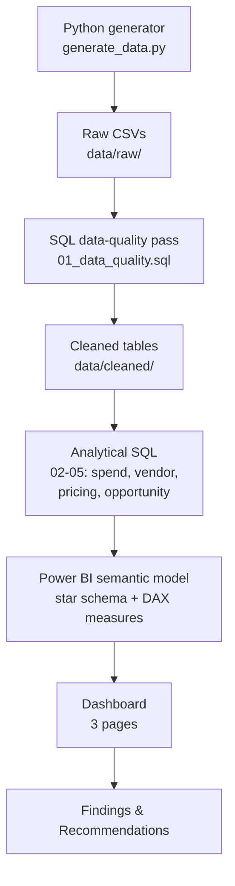

# Process Map

This documents the end-to-end pipeline for this project — where data comes
from, what happens to it at each stage, and what artifact each stage produces.
It reflects the architecture locked in PROJECT_SPEC.md, not final results
(see findings.md / recommendations.md, added once real analysis exists).

## Stage notes

| Stage | Input | Output | Status |
|---|---|---|---|
| Data generation | Business rules (PROJECT_SPEC) | 5 raw CSVs | ✅ Done, validated |
| Data-quality SQL | Raw CSVs | Cleaned tables + a quality report (what was wrong, how much, how it was fixed) | ⚪ Not started |
| Analytical SQL | Cleaned tables | Query results answering each core business question | ⚪ Not started |
| Power BI model | Cleaned tables (or SQL views) | Star schema + KPI measures matching PROJECT_SPEC definitions | ⚪ Not started |
| Dashboard | Power BI model | 3-page .pbix (Executive Overview, Vendor Performance, Opportunities) | ⚪ Not started |
| Findings & Recommendations | Dashboard + SQL results | findings.md / recommendations.md | ⚪ Not started — intentionally not written until real analysis exists |

Note on the last row: this project's stated philosophy (PROJECT_SPEC section
on "no predetermined findings") means this stage genuinely can't be written
early — doing so would mean writing conclusions before the data supports them.